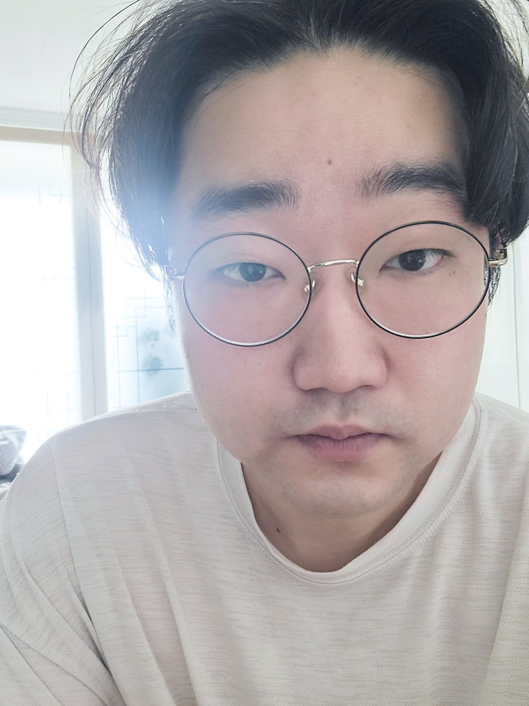
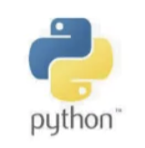
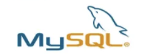

# person_who_suit_me

---
## PROJECT LOGO

## 1. 프로젝트 정보
---
* Create a conversation simulator by classifying physiognomy and speaking methods by type and converting them into data.

* 관상, 화법을 Type 별로 분류하고 데이터화 하여 대화 시뮬레이터 만들기
---

## 2. 팀 소개
---
|최현우|

---

## 3. 프로젝트 소개 (진행 이유)
---

* Have you all had a lot of trouble with conversations in your personal relationships in your life? I believe that communication between people is the most important part of a relationship. I think there are people who match my personality, and there are cases where I need to continue a relationship with someone who doesn't, and there are relationships I want to pursue.

* By converting the **perspective** and **speech style** of various people into data by type like MBTI, you can experience the other person in advance by conducting a conversation simulation according to the desired purpose, and find improvements in your own conversation depending on the type. This is a project to develop AI apps that can be used.

* I hope that relationships between people will improve through conversation by trying to recover or practice in the case of conversational disputes and relationship recovery.

* 각양각색의 사람들의 **관상**과 **화법**을 MBTI 처럼 유형 별로 데이터화 하여 원하는 목적에 맞게 대화 시뮬레이션을 하여 상대를 미리 체험해 볼 수도 있고, 유형에 따라 본인의 대화의 개선점을 찾을 수도 있는 AI 앱 개발을 하는 프로젝트 입니다.

* 다들 살아오면서 인간관계에서 대화로 인한 고민이 많으셨죠? 사람 간의 대화는 관계에서 가장 중요한 부분이라고 생각합니다. 나와의 성향과 맞는 사람도 있고, 맞지 않지만 관계를 지속해야 하는 경우도 있고 맞춰 가고 싶은 관계도 있다고 생각합니다.

* 대화의 분쟁, 관계의 회복에서도 복기를 해보거나 연습을 하여 사람들 간의 관계가 대화를 통하여 좋아졌으면 하는 바램입니다.
---

## 4. 기술 스택
---

---

## 5. 주요 기능
---

* **Text To Sentence**, **Image To Text**, **Text To Text** Using the API, create an avatar that can be simulated by configuring existing physiognomy data and data on speaking style, and then chat with the avatar. As we proceed, we try to recreate a more perfect situation.

* The reason for using physiognomy is to make a more accurate diagnosis through the image shown by the other person in conversation as it contains information about a person's past.

* The purpose of converting speech into data is to diagnose the degree of matching with the other person by thinking that the speech itself is an important indicator in a relationship because it is a way to express to the other person differently from one's feelings.

* We plan to add a feature related to 'facial expressions' in the future so that you can receive reactions in real time during conversations with avatars.

* **Text To Sentence**, **Image To Text**, **Text To Text** API를 이용하여 현존 하는 관상학 데이터와 화법에 관한 데이터를 구성하여 시뮬레이션 할 수 있는 아바타 생성 후 해당 아바타와 대화를 진행해 보면서 더욱 완벽한 상황을 재연해 봅니다.

* 관상학을 사용하는 이유는 사람의 과거가 담겨져 있는 정보로서 대화에서 상대에게서 보여지는 이미지를 통하여 더욱 정확한 진단을 위함입니다.

* 화법을 데이터화 하려는 것은 화법 자체는 마음과 다르게도 상대에게 표현할 수 있는 방법이기에 관계에서 중요한 지표라 생각하여 데이터화 해서 상대와 매칭 정도를 진단하기 위함입니다.

* 추후 '표정'에 관한 기능도 추가하여 아바타와의 대화에서 실시간으로 리액션을 받아볼 수 있게 구현할 예정입니다.

---

 ---
 1. Check my physiognomy type and speaking type
 2. Create my avatar
 3. Enter the opponent’s physiognomy type and speech type.
 4. Create the opponent's avatar
 5. Conversation simulation progress
 6. Check for improvements and suitability to better suit the        opponent type
 ---
 ---
 1. 나의 관상 Type, 화법 Type 확인
 2. 나의 아바타 생성
 3. 상대의 관상 Type, 화법 Type 입력
 4. 상대의 아바타 생성
 5. 대화 시뮬레이션 진행
 6. 상대 유형에 더욱 맞출 수 있는 개선점 및 적합성 확인
 ---

## 6. 아키텍처 (분할형 아키텍처)
---

---
## 7. 사용할 수 있는 비전
---

---